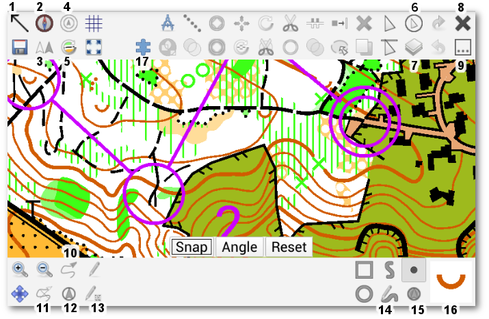

On startup, the app shows a list of map files available from the [supported storage locations](android-storage.md). To start editing a map, touch its filename.

This will show a map editor screen which is similar to the desktop version. In the following, only the functionality which differs from the desktop version will be explained. To find out about the other symbols, see [Toolbars](toolbars.md) in the desktop application's manual.

## The mobile map editor

(1) Hides the top bar.

(2) Compass display toggle

When this item is activated, a compass is shown in the top-left corner of the screen. The red line indicates the north direction, while the black-white lines show the up direction of your device. If both are aligned, the device is aligned with magnetic north. When the needle is close to the north direction, a green circle appears which quickly shows how well the device is aligned: the larger it is, the better the alignment is. The compass works three-dimensionally, so you do not need to hold the device in a flat pose for it to work.

Note: the usefulness of the compass depends on the presence of a gyroscope, as mentioned in the device recommendations section.

Attention: the compass is very sensitive to magnetic materials. Android tries the eliminate the influence of local magnetic fields, but this requires calibration. To do this, move the device around in the shape of an 8 while rotating it and while the compass is active. If the local influence changes, re-calibration is required.

(3) GPS position display toggle

If the currently active map work has valid global geographic coordinate system settings, this control will be enabled and will show a dot at your current position. In addition, in case an accuracy estimate (HDOP) is available, this shows a circle around the dot which indicates the positioning accuracy. The chance of your real position being in the circle is approximately 70%.

While this is active, your GPS track is automatically recorded into a GPX file in the directory of your map, named "<map> - GPS-<YYYY-MM-DD>.gpx". This file is included as a template in the map. You can simply show it using button (7) to view your track.

Note that track recording might be interrupted while the screen is off or the app is in the background to save battery. Keep the app active if you want to ensure continuous track recording.

(4) GPS distance rings toggle

This button is active if GPS position display is active. When activated, this will display rings in 10 meter and 20 meter distance from the GPS position which can be used to do rough distance estimates.

(5) Automatic north alignment of map toggle

When this toggle is active, the map is automatically rotated to north using the device's internal compass. The update frequency is 1 update per second. This is quite low on purpose to save battery, but you probably still need some replacement batteries when using this mode. While interacting with the map and for another 1.5 seconds after that, the map is not rotated to allow editing without unwanted rotations. If GPS position display is activated at the same time, a line starting from the GPS position and going in the direction of the up direction of your device is displayed which shows your viewing direction (assuming you are holding the device upright).

(6) Touch cursor toggle

This symbol activates a helper cursor which allows slow, but precise editing with fingers only. The cursor consists of a circular area and a pointer above the circle.

Touching the map anywhere outside the circle moves the pointer to this position. Touching the circle simulates a real touch at the pointer position above the circle.

(7) Template visibility toggle

This shows a list of all opened templates. Touching a template toggles its visibility.

(8) Close button

This closes the active map and returns to the map selection screen.

(9) Overflow button

Depending on the screen size of your device, some of the symbols available not fit onto the screen. They are instead placed in a list which is shown on touching the overflow button. If all symbols fit on the screen, this button is unused.

(10) Record temporary GPS trace

This symbol is enabled when the GPS position display is active. It records a temporary trace of the GPS position, which is intended to act as a guideline for drawings. Using the GPS trace directly is rarely useful because of the GPS uncertainty.
Note that the temporary trace is not saved in the map.

(11) Clear temporary GPS markers

This removes the traces and markers created with (10) and (12). (They will also be discarded when closing the map file.)

(12) Record temporary GPS position

This records a single point at your current GPS position to act as drawing help. Note that this marker is not saved in the map.

(13) Paint-on-template settings

This button allows to select the active image for scribbling (using the symbol above it).

(14) Free-hand draw tool

Allows to draw paths free-handedly.

(15) GPS point draw tool

Sets a point object at the GPS position. Selecting this button first enters an averaging mode. While it is active, the GPS position is averaged to get a more accurate estimate. Touch the map display anywhere to finish the averaging.

(16) Symbol selector

Displays the active symbol, and opens the symbol selection screen on short press.

A long press of the symbol selector opens a popup menu which allows to read the symbol name and description, and to toggle the visibility and the protection state of the symbol.

(17) Map parts selector

This button opens a popup for changing the active map part.
