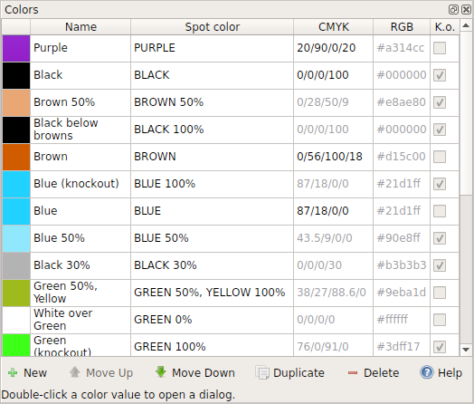

This window can be shown by clicking the menu item Symbols -&gt; Color window.

#### Introduction

Colors on orienteering maps are defined in the orienteering map standards, ISOM and ISSOM, as colors from the Pantone Matching System (PMS). The recommended way to print maps is to use these spot colors to print each color layer separately onto the map sheet. This way colors printed later will overlap colors which are printed earlier. The color system in OpenOrienteering Mapper follows this analogy: each map file contains a prioritized list of available colors, where colors higher in the list overlap lower colors.

Colors can be managed with the buttons at the bottom of the list. To edit a color, double click its entry in the color list.

### Color editor

Today there are different methods for printing maps and the color editor in OpenOrienteering Mapper is adjusted to that, so there are different settings for "desktop" and "professional" printing.

#### Desktop printing

The first page addresses "desktop" printing, i.e. printing maps with cheap home laser printers. These devices use the **RGB color space** to define colors, where each color consists of a given amount of red, green and blue (this is not to be confused with how the colors are actually printed; it is just how the PC tells the printer which color to print). So on the desktop page, you can define how the RGB value for a color should be calculated by OpenOrienteering Mapper:

 - **Evaluate spot colors**: the spot colors referenced by this color will define its RGB color. This is only possible if this color references at least one spot color (see later)
 - **Evaluate CMYK color**: the CMYK value of this color will be converted to a RGB value (see later)
 - **Custom RGB color**: you can enter the RGB value directly

Note that while defining RGB colors is enough for normal desktop printing, using the [overprinting simulation](view_menu.md#overprinting) effect requires to define spot color printing options also.

#### Professional printing

This page is divided into two parts. On the left are the settings for **spot color printing**:

 - If the first option is activated, this color entry represents a spot color and will thus define a color layer. Enter the spot color name in the text field below the option.
 - If the second option is activated, this color entry represents a color which is printed as a percentage of a spot color (screen) or a mixture of multiple spot colors (overprint). Choose the referenced spot colors and their amounts below.

When multiple colors overlap each other on the map and [overprinting simulation](view_menu.md#overprinting) is activated, the program simulates the effect of overprinting real spot colors where the colors are darkened when printed on top of each other. This can be very useful to increase map legibility, however it is not desired in all situations. Sometimes a color on top of another should erase the lower color completely. This can be set by activating the "**Knockout**" option.

On the right side of the professional page, there are the options for **CMYK color printing**. These are similar to the RGB color options:

 - **Evaluate spot colors**: the spot colors referenced by this color will define its CMYK color. This is only possible if this color references at least one spot color
 - **Evaluate RGB color**: the RGB value of this color will be converted to a CMYK value
 - **Custom process color**: you can enter the CMYK value directly
