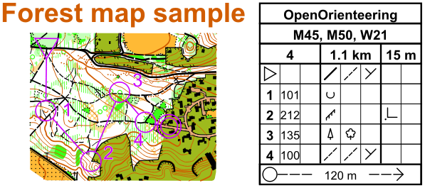

[Templates]: templates.md
[IOF Homepage]: https://orienteering.org

OpenOrienteering Mapper doesn't have a sophisticated course planning feature.
The Course Design symbol set provides basic support for designing maps with
courses and control desriptions. It contains the overprinting symbols from the
ISOM 2000 and the control descriptions from IOF's "International Specification
for Control Descriptions - 2004". See the [IOF Homepage] for details.

## Loading a base map

Open the base map as a template in the background. See [Templates] for details.

## Drawing the course

For simple courses which consist only of start, controls, finish and free
navigation you may use symbol 799 Simple Orienteering Course. For more complex
courses use the individual overprinting symbols. The labels for the controls
have to be created explicitly.

## Creating the control description sheet

The Course Design symbol set contains the individual pictograms as well as
symbols for the different sections which together form the control description
sheet. The pictograms' names indicate the column of the control description sheet where
they are to be used.

The control description symbols are meant to be used with a grid of horizontal
and vertical lines spaced 3.0 millimeters. By pressing the Shift key while
creating a new element, you may easily align all the parts of the description.

## About the control description sheet

The control description sheet starts with a heading which consists of blocks for
the event title, classes (optional), and (in a single row) course code, course
length and and height climb. The course length is given in kilometres rounded to
the nearest 0.1 km. The height climb is given in metres rounded to the nearest
5 m.

The heading is followed by lines describing the start location, the individual
controls, and special routes. The description of start and individual controls
uses eight colums which are refered to as A...H.

| Column | Description |
| ------ | ----------- |
| A      | Control number. Numbering of controls is in the sequence they are to be visited, unless the description is for a Score competition. |
| B      | Control code. The control code should be a number greater than 30. |
| C      | Which of any similar feature. This column is used when there is more than one similar feature within the control circle; e.g. south eastern. |
| D      | Control feature. The feature, as shown on the map, at the centre of the circle deÞ ning the control site; e.g. clearing; boulder. The description of each control is based on the International Specification for Orienteering Maps (ISOM 2000). |
| E      | Appearance. Further information on the nature of the feature if it is required; e.g. overgrown; ruined. In certain circumstances also used for a second control feature where the description requires this. |
 | F      | Dimensions / Combinations. Dimensions of the feature should be given where the size of the control feature on the map is symbolic rather than to scale. Also used for the two combination symbols (crossing; junction). |
| G       | Location of the control flag. Position of the control flag with respect to the feature; e.g. west corner (outside); south foot. |
| H       | Other information. Other information that may be of importance to the competitor; e.g. radio control; refreshments. |

## Specifications for Trail Orienteering

There are two variations in the use of the columns when using IOF Control Descriptions for Trail Orienteering.

| Column | Description |
| ------ | ----------- |
| B      | Number of control flags. This column is used to denote the number of control flags visible at this control; e.g. A-C equals three control flags to choose from; A-D equals four control flags to choose from. |
| H      | Direction of observation. This column is used to denote the direction in which to view a feature. For example an arrow pointing north indicates that the competitor should be on a path/track to the south of the control circle. |
