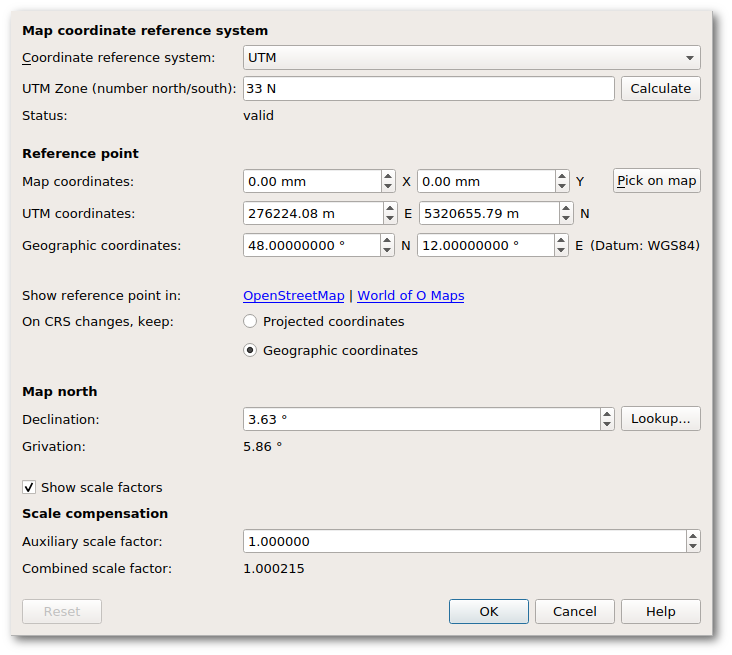

 - [Introduction](#introduction)
 - [Coordinate Reference System](#coordinate-reference-system)
 - [Georeferencing dialog](#georeferencing-dialog)
 - [Related functions](#related-functions)
 - [Glossary](#glossary)
 - [Further reading](#further-reading)

### Introduction

Georeferencing of a map is the best way for aligning templates (such as base maps or aerial imagery) and GPS tracks. In short, to georeference a map means to establish a known relationship between the paper coordinates of the map and the coordinates of a geographic coordinate reference system. This way, data which is known in a geographic coordinate reference system (such as GPS coordinates) can be transformed to map coordinates and thus displayed on the map, and vice versa the map can be transformed to geographic coordinates and e.g. be displayed on a world map. More information is available on [Wikipedia](https://en.wikipedia.org/wiki/Georeferencing).

To georeference a map, Mapper associates its points with latitude-longitude coordinate values based on the standard WGS85 or similar datum. The user draws on a “canvas” to define a paper map which is

 - reduced by a *scale factor* from the real-world units of meters to a paper grid measured in millimeters,
 - reoriented by a *declination angle* from the datum’s geographic north so that magnetic north is “up” on the paper, and
 - positioned with a map origin *reference point* having a specific latitude and longitude.

These three parameters, specified by the mapper, determine a latitude and longitude for every point on the map’s canvas.

#### Map coordinates

Map coordinates indicate the placement of figures (objects) on the screen or page. Map coordinates are rectangular on the page. Because the map covers a relatively small area, it can be oriented to magnetic north and scaled to represent distances on the ground with practically no distortion.

Map coordinates are measured in millimeters on the printed paper, for usefulness in relation to the map’s printed size. The first coordinate is horizontal, increasing to the right. The second is vertical, increasing toward the top of the page. The choice of origin (0,0) is arbitrary, and rarely matters.

Mapper keeps the locations of objects using the map coordinates.  For example, when importing features into Mapper that are specified in geographical coordinates, such as a GPS track or OpenStreetMap data, Mapper converts them into objects having map coordinates, and discards the source coordinates.

Because Mapper is for orienteering maps, the map orientation has magnetic north aligned upward.

#### Geographic coordinates and datum

**Geographic coordinates** specify a location on the planet’s surface by latitude and longitude. Latitude and longitude are measured in degrees. Also note that according to convention, the first coordinate is the latitude and the second the longitude. A geographic coordinate system is said to be unprojected because it defines positions on a sphere or ellipsoid.

The map’s **datum** governs the meaning of the coordinates. Specifically in Mapper the prime meridian always coincides with the datum’s origin, and its unit is always degrees.

Mapper assumes that the datum is WGS84, which is often correct. When the datum does not match WGS84, the difference is usually small. For example, North American datums typically differ from WGS84 by 1 meter or so.

 - The **latitude** specifies the north-south position of the reference point as an angle relative to the equatorial plane. Negative values indicate the southern hemisphere.
 - The **longitude** specifies the east-west position as angle relative to a prime meridian. Negative values indicate a position west of the prime meridian. The datum is especially relevant for the longitude.

Mapper can display geographic coordinates as decimal degrees, or as degrees-minutes-seconds.

The datum also provides an ellipsoid model of the Earth’s size and shape. This enables changes in latitude and longitude to be converted to distance and azimuth on the surface. Similarly, a path on the surface can be converted to a change in latitude and longitude.

A **geometric datum** is based on an **ellipsoid** surface, abstracting the earth’s shape and size. In addition to its surface, a datum specifies the origin and orientation relative to the earth. For geographic purposes the ellipsoids of interest are all **spheroids**, so the terms are interchangeable.

For example, NAD 1983 is tailored to North America.  Its origin is at the earth’s center of mass, and relative to WGS 1984 it moves with the North American tectonic plate.

Transforming coordinates of a georeferenced template can involve substantive transformations between datums. In North America the most common datums are NAD 1983 and WGS 1984, and the discrepancy between these is about a meter.

A replacement for NAD 83 is being developed, North American Terrestrial Reference Frame of 2022 (NATRF2022). It agrees with the ITRF at epoch 2020.0, and since then remains fixed to the North American plate.

#### Reference point

The **reference point** anchors a point on the map to a location on the planet. The user specifies geographic coordinates to indicate this point on the Earth’s surface. This is called the **geographic reference point**. The corresponding point on the map is called the **map reference point**.

For simplicity, on this page it will usually assume that the map coordinate system originates at the reference point, which would have map coordinates (0,0).

Reference point in Mapper is not to be confused with the GIS terms “datum reference point” or “control point”. 

#### Orientation

The user specifies the **declination**, the angle between true north and magnetic north at the position of the map. Mapper applies this setting to orient the geographic coordinate system at an angle from “up” on the map. (Note that if the map’s declination is set to 0, then the map will be oriented to geographic north.)

Declination is the direction of magnetic north, measured in degrees. It increases clockwise, like a geographic azimuth. A direction east of north is positive, while a direction west of north is negative.

Actual declination can vary across the terrain covered by the map and changes with time. Fortunately, the amount of variation is rarely enough that a mapper would need to take special care.

#### Scale

The user specifies two scale parameters that matter to georeferencing.

The map’s **scale** is primary. It is the ratio of distance on the ground to distance on the map.

The **auxiliary scale factor** influences the transformation of map coordinates to geographic coordinates. It is also known as elevation factor or orthometric height factor. The auxiliary scale factor is typically 1.0, having no effect. However, for a map at the altitude of 1,800 meters above the ellipsoid, where the auxiliary scale factor is 0.9997, it would make a slight difference. It is the ratio between the size of a degree on the ellipsoid surface and the size of a degree at ground level.

### Coordinate Reference System (CRS)

Whenever Mapper sets up georeferencing for a map or template, it uses a **coordinate reference system (CRS)** to define the **projection** between the curved ellipsoid and a flat, rectangular coordinate system. In general, a CRS is a coordinate-based system used to locate geographic entities. It defines a specific map projection and a transformation from/to geographic coordinates. Standard CRSes can be referred to using a SRID integer, including EPSG codes.

Do not confuse “CRS” with “coordinate system”. The former is more standardized and has a projection that relates it to a datum.

Each CRS used by Mapper

 - is based on a specific *datum*
 - defines a projection between the datum’s ellipsoid (geographic coordinates) and a two-dimensional grid
 - uses a pair called **projected coordinates** for a point in the grid
 - calls the two grid coordinates Easting and Northing
 - measures Easting and Northing values in meters

With Mapper, the term **grid** usually refers to the CRS’s projected coordinate system (although map coordinates and geographic coordinates could also be considered as grids). The Easting and Northing coordinates of a point are called **projected coordinates**.

Coordinates, as northings and eastings, are said to be *projected* because they define positions on a (flat) plane – they have been “thrown forth” (projected), from a spheroid.

Note that because the projected system is flattened from a spheroid, its meters are nominal meters that vary a little from exact meters on the spheroid. Similarly, easting and northing may be oriented at an angle from geographic east and north.

A spatial reference system identifier (**SRID**) is typically associated with a string description of the datum, geoid, coordinate system, and map projection.

#### Why projected coordinates

Projected coordinates are an intermediate stage in transformations between map coordinates and geographic coordinates. Conversions between map coordinates and projected coordinates are made as a similarity transform determined by map scale, auxiliary scale factor, declination, and the reference point. Conversions between projected coordinates and geographic coordinates are made based on the map’s specified CRS. The actual geographic transformation is done by the PROJ library. 

The projected coordinate system provides a flat, two-dimensional space, upon which the features of the Earth’s surface can be represented. For example, Universal Transverse Mercator (UTM) for a specific zone. Projected coordinates are a basis for the map. Mapper calculates a correspondence between figures drawn in the map’s coordinate system, and shapes in the projected coordinate system. This keeps shapes unchanged, while allowing the map to be oriented, scaled, and cropped freely.

#### Grid orientation

Mapper takes into account that the grid does not align perfectly with the ellipsoid in either orientation or scale. From the projection, it determines the discrepancies. As they can vary slightly across the map, Mapper analyzes them at the reference point. It compensates for them when transforming between map coordinates and projected coordinates, in all georeferencing calculations.

Mapper obtains the angle difference between grid north and geographic north.
**Convergence** is the direction of grid north, measured in degrees. It increases clockwise, like a geographic azimuth. To transform a map azimuth to a grid azimuth, Mapper needs to add the declination to get geographic azimuth, then subtract the convergence. To do this in one step, it calculates **grivation**:

- `grivation = declination - convergence`

Grivation is the direction of megnetic north measured as an azimuth on the grid.
Grivation determines the rotation which turns the projected grid so that magnetic north is at the top of the map. This rotation is the only effect of the declination setting.

Grivation is short for “grid variation”.

#### Grid scale

From the CRS, Mapper obtains the scale proportion between grid meters and ellipsoid meters, at the reference point.
The **grid scale factor** is the size of an ellipsoid meter on the grid (grid units per ellipsoid unit). To transform a map distance to a grid distance, Mapper needs to multiply by the scale denominator, by the auxiliary scale factor, and by the grid scale factor. To eliminate one step, it calculates **combined scale factor**:

 - `combined_scale_factor = auxiliary_scale_factor * grid_scale_factor`

Combined scale factor is the ratio between length in projected coordinates and the length on the ground.

#### Latitude/longitude calculation details

Each map object has a one or more x,y positions. An object’s geographic coordinates are calculated as needed. The calculation is determined by the map’s georeferencing parameters.

**Scale denominator** is Mapper’s internal representation of the scale. For example, in a map with scale 1:5,000, the scale could be represented by the fraction 1/5,000., Its scale denominator is 5,000.

To calculate the geographic coordinates of a point on the map,

 - Start with the given point’s distance on the map from the reference point, in millimeters.
 - Divide the distance by 1000, yielding distance on the map, in meters.
 - Multiply by the map scale denominator, yielding distance in real world meters.
 - Multiply by the combined scale factor, yielding the distance on the projected grid (in meters).

Having distance, continue and calculate azimuth,
 
 - Start with the given point’s (magnetic) azimuth from the reference point, on the map.
 - Add the grivation, yielding grid azimuth from the reference point.

Having distance and azimuth, find latitude/longitude
 
 - In the projected coordinate system, from the reference point, along the line defined by the azimuth, find the point at the calculated distance.
 - Use the CRS to transform (Easting, Northing) to (latitude, longitude).

### Georeferencing dialog

Georeferencing properties are set in a dialog which is available from the menu **Map &gt; Georeferencing...**. The dialog is divided into four sections: Map coordinate reference system, Reference point, Map north, and Scale compensation.

#### Map coordinate reference system

This section specifies the projection which relates latitude/longitude to flat coordinates. The coordinate reference system is one important step in relating coordinates on the round Earth to coordinates on the flat paper map. The additional steps are scaling, rotation, and adding an offset.

In case you just want to load some GPS tracks, you can safely use UTM, which is widely used world-wide. Other choices are:

 - **Gauss-Kr&uuml;ger**: this is similar to UTM and widely used in Germany, but is being superseded by UTM.
 - **From Proj.4 specification**: projections are internally handled by the [PROJ.4 Cartographic Projections library](https://proj4.org/), so coordinate reference systems can also be given in its internal specification format. Examples may be found at [http://www.remotesensing.org/geotiff/proj_list/ (Internet Archive)](https://web.archive.org/web/20160802172057/http://www.remotesensing.org/geotiff/proj_list/) and [https://spatialreference.org/](https://spatialreference.org/). When selecting this option, the specification field will be pre-filled with the specification of the previously selected coordinate reference system.
 - **EPSG**: for any coordinate reference system in this extensive worldwide registry.
 - **Local**: this enables you to use local projected coordinates without a mapping to global geographic coordinates.

Depending on the selected coordinate reference system more settings may show up. For example, for UTM the zone number must be given in addition.

#### Reference point

Settings in this section define the reference point, which is a point for which coordinates in all of the involved coordinate systems are known. It acts as the anchor between the different coordinate reference systems. It is also the point in the geographic coordinate system where the scale and magnetic orientation of the map are established in relation to ground distances and geographic north. 

In case the georeferencing dialog is triggered by loading a georeferenced template in a map which is not georeferenced yet, these settings are probably already pre-filled with sensible values (assuming that no other map objects exist yet), so they do not need to be changed in this case.

In case the map is already well-georeferenced, any change to the reference point coordinates must update all three coordinate pairs to new values which match one another. Otherwise the geographic coordinates of map objects will be disrupted. In other words, there are many possible good settings for the reference point section. Any point on the map could be used, together with its corresponding coordinates on the grid and in latitude/longitude. However, there are even more erroneous settings, because every point on the map has a million points on the grid and Earth that do not correspond. 

The **Map coordinates** field shows the map paper coordinates of this point. To change them, use the **Pick on map** button. The georeferencing dialog will then be hidden until you select a point on the map (left mouse click) or cancel the selection process (another mouse button). Changing the reference point on the map will not affect the other sections.

The next set of coordinates gives the reference point east-west and north-south position in **projected coordinates**, for example in UTM or Gauss-Kr&uuml;ger coordinates. Unless working with local coordinates, changing easting or northing will update the geographic coordinates.

The third set of coordinates gives the reference point position in **geographic coordinates**. Note that after the selection of a coordinate reference system other than local, projected and geographic coordinates are linked together, so changing one will also change the other. Geographic coordinates are measured in decimal degrees. Also note that according to convention, the first coordinate here is the latitude and the second the longitude.

 - The **latitude** specifies the north-south position of the reference point as an angle relative to the equatorial plane. Negative values indicate the southern hemisphere.
 - The **longitude** specifies the east-west position as angle relative to a prime meridian. Negative values indicate a position west of the prime meridian.

The **Datum** field shows the datum the geographic coordinates refer to.

The second to last line in the Reference point section contains a hyperlink for opening the reference point in OpenStreetMap.

The last option in this section determines which coordinates will be recalculated and which stay the same when changing the coordinate reference system. To avoid disrupting the geographic coordinates of map objects when the CRS changes, the button to *keep* the reference point’s *geographic* coordinates must be left enabled.

#### Map north

In the **Declination** field the angle between true north and magnetic north at the position of the map has to be entered to make magnetic north be at the top. This can be looked up from an online accessible model as soon as the reference point geographic coordinates are entered, however it should be checked with a precise compass if accuracy is required.

Grivation, defined above, is displayed for information purposes.

When the user changes the declination, a question pops up: “Do you want to rotate the map content accordingly, too?” Supposing the map is already well-georeferenced, click “Yes” to preserve the good georferencing. Clicking “No” would leave the drawn map as is, but rotate the geographical positions of all the map content.

#### Scale compensation

**Auxiliary scale factor** may be set to compensate when distances on the ground differ from distances on the Earth model, such as occurs when the terrain is at high altitude. It is the ratio of model distance to ground distance. The default factor of 1.0 has no effect.

Grid scale factor, defined above, is displayed for information purposes.

When the user changes the auxiliary scale factor, a question pops up: “The scale factor has been changed. Do you want to stretch/shrink the map content accordingly, too?” Supposing the map is already well-georeferenced, click “Yes” to preserve the good georferencing. Clicking “No” would leave the drawn map as is, but rotate the geographical positions of all the map content.

### Related functions

#### Map rotation dialog

To avoid disrupting the geographic coordinates of map objects, the checkboxes to adjust georeferencing and to rotate templates must be left checked (enabled).

#### Map scaling dialog

To avoid disrupting the geographic coordinates of map objects, the checkboxes to scale positions, adjust reference point, and scale templates must be left checked (enabled).

#### Settings

The default, basic Georeferencing dialog is lacking a few of the above-described options that are not generally needed. The settings (menu File > Settings > Georeferencing) can enable these advanced features.

The (mouse) cursor position of the map editor can be displayed in map coordinates, projected coordinates or geographic coordinates (decimal or as degrees/minutes/seconds, DMS). The coordinates of the cursor on the map sheet are discussed [here](view_menu.md#coorddisplay).

### Glossary

A map is **georeferenced** if it is associated with a mathematical transformation between its internal (map coordinate system and a ground system of geographic coordinates. The geographic coordinate system often is provided by naming a standard datum.

Orienteering maps, being two-dimensional, encounter height considerations separately from latitude/longitude, etc. Height is generally measured relative to a **geoid**, a standard surface of approximately equal gravitatational potential. The geoid is defined relative to a datum’s ellipsoid. As an example, for NAVD88, Geoid 12B (for East Tennessee and its LiDAR data) is about 30 meters beneath the ellipsoid. **Orthometric height** is the term for height above the geoid. **Ellipsoidal height** arises in simpler 3D coordinate systems. A **vertical datum** is the reference surface for measuring height, whether geoid or ellipsoid.

### Further reading

 - Wikipedia: [Geographic coordinate systems](https://en.wikipedia.org/wiki/Geographic_coordinate_system)
 - Richard Knippers (2009): [Geometric Aspects of Mapping](https://kartoweb.itc.nl/geometrics/)
 - Larry Simons (2005): [Magnetic Declination &amp; Grid Convergence](http://www.threelittlemaids.co.uk/magdec/explain.html)
