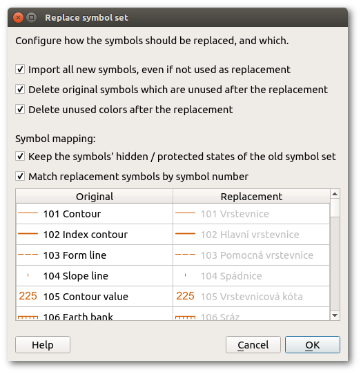

This dialog enables to replace the symbol set in the current map file by the set of another file. It is possible to accurately select a replacement symbol for each old symbol. Show it by clicking the menu item Symbols -&gt; Replace symbol set..., then select the map file from which to take the new symbol set. Note that this is not a way to e.g. rescale a map from 1:10000 to 1:15000, use Map -> Scale map... instead.

#### Import all new symbols, even if not used as replacement

If there are symbols in the new symbol set which are not matched to any existing symbol, they will be imported as additional symbols if this option is checked, otherwise they will be omitted. This is useful to import symbols of the new set which had no counterpart in the old one.

#### Delete original symbols which are unused after the replacement

If this toggle is activated, all symbols of the old set which are not in use after replacing all chosen symbols will be deleted. This is useful to clean up symbols which are not needed anymore by the new set.

#### Delete unused colors after the replacement

Deletes all colors which are not used by any symbol after the replacement. This is useful to clean up the color list.

#### Match replacement symbols by symbol number

As long as this check is activated, replacement symbols will be matched to existing symbols based on their numbers only. You can check the replacements in the symbol list below. After deactivating this, you can choose any replacement symbol (or also to not replace a certain symbol) for any old symbol by clicking the replacement symbol in the list and choosing the desired option.
