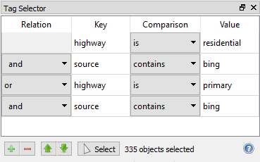

The tag selector is opened from the View menu. It allows the selection of objects based on their tags.



## Editor Layout

Each row in the editor represents a single condition in the query and its relation to the other conditions.

### Relation

The relation column specifies a logical operator describing how this row is related to the row above. Therefore the first row has no relation.

There are two possible relations: **and** or **or**. **and** relations take precedence over **or** relations. Within the editor the **and** relation is indented slightly to show this precedence.

Taking the precedence into account, the query in the screenshot above would be interpreted as:

```
("highway" is "residential" and "source" contains "bing") or ("highway" is "primary" and "source" contains "bing")
```

### Key

The key is the name of the tag which this condition applies to. This field cannot be left empty.

### Value

This field specifies a value that the actual tag's value is compared to.
It can be left empty.

### Comparison

The comparison defines how the actual value of the tag is compared to the value that was specified in the editor.

| Comparison | Description |
| ---------- | ----------- |
| is         | The tag specified must exist for the object, and that tag's value must exactly match the specified value. |
| is not     | If the tag specified exists for the object, then its value must not much the specified value. If the tag doesn't exist, the condition is true. |
| contains   | The tag specified must exist for the object, and its value must contain the specified value. If an empty value is specified, any value of the tag will match. This can be used to test for the existence of a particular tag. |

### Buttons

The  and  buttons are used to add or delete a row.
Added rows appear below the currently selected row.

The  and  buttons move the selected row up or down.

The Select button evaluates the query on all objects in the current part, and selects those which match. The status information displays how many objects were selected. If any conditions contain an empty key, the query is invalid and no objects are selected.
