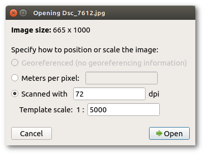

Images, tracks recorded with GNSS receivers and other layers which are used to provide base information for the mapper are called templates. They can be loaded into the map file using the template setup window which is available via the menu item Templates -&gt; Template Setup Window. Templates can also be "abused" to display information on the final map, for example sponsor logos which are only available as raster images.

**Attention**: as templates are not covered by the undo/redo system, be sure to save your map before making changes to them!

#### Types of templates

OpenOrienteering Mapper supports the following file formats to be loaded as templates:

 - [Raster images](#image-templates) (bmp, jpg, png, gif and [formats supported by GDAL](gdal.md))
 - Geospatial vector data (cf. [geospatial data support with GDAL](gdal.md))
 - [GPX tracks](#track-templates) (gpx)
 - [Map files](#map-templates) (omap, xmap, ocd)

Additionally, templates can be classified into **georeferenced** and **non-georeferenced** templates. For georeferenced templates, information about the exact positioning of the template in a known world coordinate system is available - see [georeferencing](georeferencing.md). This way, they can be positioned on the map automatically provided that the map is georeferenced too. For non-georeferenced templates, this information is not available, so they have to be [positioned manually](#positioning).

#### Template setup window  {#setup}

This window is opened by clicking the menu item Templates -&gt; Template Setup Window. In its center is a list of all opened templates. In addition, the map layer is also included there. The order of items in this list defines the order in which the templates will be displayed: the first will be on the top, the last on the bottom.

Each item can be hidden or shown using the check box on the left. Furthermore, layers can be set to transparent by entering an opacity percentage.

#### Opening templates

Click the button "Open..." in the template setup window and select the file to be loaded as a template. See [types of templates](#template-types) for the list of supported file formats.

#### Changing the template draw order

When a template is selected, it can be moved up and down in the list using the Move Up and Mode Down buttons to change its position in the display order.

#### Deleting or closing templates

Using the Delete or Close button, templates can be removed. The label text depends on the [corresponding setting](settings.md#templates-keep-settings-of-closed-templates) "Keep settings of closed templates": if it is activated, it will be "Close" and it will be possible to reopen the template later with the menu item Templates -&gt; Reopen template..., otherwise it will be "Delete" and it will not be possible to reopen the template later.

#### Positioning

At the bottom of the window, there are the template positioning capabilities:

The upper left button shows whether the template is **georeferenced**. Later it may become possible to switch the georeferencing setting using this button, but this is not yet implemented.

At the lower left is the **Move by hand** button. It allows to move non-georeferenced templates by clicking in the map display and dragging the mouse.

At the lower right is the toggle for the **template positioning window**. It enables to enter numerical values for the positioning of non-georeferenced templates, e.g. to rotate a template by 90 degrees, or to adapt the template rotation to the magnetic declination.

#### Adjust
At the upper right is the **Adjust** button which enables to adjust the position of a non-georeferenced template to that of an existing template, or the map, which is in the correct position already. [Detailed instructions here](template_adjust.md).

### Template types

#### Image templates

Raster images are loaded as this template type. When opening such a template, the image positioning dialog is shown:

#### Georeferenced positioning

This option is only available if the image has georeferencing information associated.
Depending on the format, the information may be embedded (e.g. for GeoTIFF), or
come in auxiliary files such as so-called world files.

World files are text files containing 6 entries of a transformation matrix
mapping pixel coordinates to grid coordinates of some geodetic coordinate reference system
([more information on Wikipedia](https://en.wikipedia.org/wiki/World_file)).
Unfortunately, a world file does not specify the actual coordinate reference system.
So if you choose this option for positioning, you usually have to specify the
coordinate reference system in the next step. You should get this information
from the place where you got the georeferenced image from.

A world file for an image must have the same file name as the image file and
be located in the same directory.
The world file extension is determined by the image extension:
it starts with the first character of the image file extension,
followed by the last character of this extension, and then the letter 'w'.
For example, a world file for a png file would have the extension "pgw".
Alternatively, the world file extension can also be "wld".

In order for georeferenced positioning to work, the map must be georeferenced, too.
If the georeferencing is not yet configured when loading a georeferenced template,
the [map georeferencing dialog](georeferencing.md) is shown as the next step,
with reference point coordinates already pre-filled as the center of the loaded image.

#### Manual positioning

This method of positioning should only be chosen if you have no georeferencing information available for the image. First, there are two possible options to specify the image scale:

 - **Meters per pixel**: this is primarily useful for base maps from a digital source, where you may know this value directly. Alternatively you can also calculate it yourself: if your fieldwork image covers 500m width on the ground and the image is 1200 pixels wide then the scale will be 500 / 1200 = 0.625 meters per pixel. (Take care that the number of meters corresponds exactly to the width of the image file.)
 - **Scanned**: if your fieldwork is at a known scale (it should be - say 1:5000), and the scan is at a chosen resolution (say 200dpi) then these parameters may be entered to scale the fieldwork image. This assumes that printer and scanner work accurately.

Note that if you do not know the image scale and / or if you are going to adjust the template position to the existing map anyway using the [adjust feature](#adjust), you can just enter any value here as the scaling will be changed again later.

### Track templates

These templates represent tracks from a GNSS receiver or similar.
By default, mapper uses a special template type to display this type of files.
However, it is possible to disable this special template type on the
GDAL [settings](settings.md) page, so that GPX tracks will be handled as
regular geospatial vector data via [GDAL](gdal.md).

### Map templates

This template type enables to load other map files as a template. This has two main purposes:

 - Loading an old orienteering map as a base map for a new one.
 - Loading a map as a base layer to set a course on top of it.

