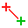

 - [Introduction](#introduction)
 - [Map coordinate reference system](#map-coordinate-reference-system)
 - [Reference point](#reference-point)
 - [Map north](#map-north)
 - [Related functions](#related-functions)
 - [Further reading](#further-reading)

#### Introduction

Georeferencing of a map is the best way for aligning templates (such as base maps or aerial imagery) and GPS tracks. In short, to georeference a map means to establish a known relationship between the paper coordinates of the map and the coordinates of a geographic coordinate reference system. This way, data which is known in a geographic coordinate reference system (such as GPS coordinates) can be transformed to map coordinates and thus displayed on the map, and vice versa the map can be transformed to geographic coordinates and e.g. be displayed on a world map. More information is available on [Wikipedia](https://en.wikipedia.org/wiki/Georeferencing).

Georeferencing properties are set in a dialog which is available from the menu **Map &gt; Georeferencing...**. The dialog is divided in three sections: Map coordinate reference system, Reference point and Map north.

#### Map coordinate reference system

This section defines in which kind of projected coordinates (real-world metric cartesian coordinates) the reference point relating map and geographic coordinates is defined. Projected coordinates are transformed to map coordinates by scaling and rotation. You should thus choose the coordinate reference system in which you know the real-world coordinates of a point on the map. In case you just want to load some GPS tracks, you can also just safely use UTM, which is widely used world-wide. Other choices are:

 - **Gauss-Kr&uuml;ger**: this is similar to UTM and widely used in Germany, but is being superseded by UTM.
 - **From Proj.4 specification**: projections are internally handled by the [PROJ.4 Cartographic Projections library](https://proj4.org/), so coordinate reference systems can also be given in its internal specification format. Examples may be found at [http://www.remotesensing.org/geotiff/proj_list/ (Internet Archive)](https://web.archive.org/web/20160802172057/http://www.remotesensing.org/geotiff/proj_list/) and [http://spatialreference.org/](http://spatialreference.org/). When selecting this option, the specification field will be pre-filled with the specification of the previously selected coordinate reference system.
 - **Local**: this enables you to use local projected coordinates without a mapping to global geographic coordinates.

Depending on the selected coordinate reference system more settings may show up. For example, for UTM the zone number must be given in addition.

#### Reference point

Settings in this section define the reference point, which is the point for which coordinates in all of the involved coordinate systems are known. Thus it acts as the anchor between the different coordinate reference systems.

In case the georeferencing dialog is triggered by loading a georeferenced template in a map which is not georeferenced yet, these settings are probably already pre-filled with sensible values (assuming that no other map objects exist yet), so they do not need to be changed in this case.

The **Map coordinates** field shows the map paper coordinates of this point. To change them, use the **Select...** button. The georeferencing dialog will then be hidden until you select a point on the map (left mouse click) or cancel the selection process (another mouse button). Changing the reference point on the map will not affect the other sections.

The next set of coordinates gives the reference point east-west and north-south position in **projected coordinates**, for example in UTM or Gauss-Kr&uuml;ger coordinates. Unless working with local coordinates, changing easting or northing will update the geographic coordinates. Easting and northing are given in meters.

The third set of coordinates gives the reference point position in **geographic coordinates**. Note that after the selection of a coordinate reference system other than local, projected and geographic coordinates are linked together, so changing one will also change the other. Geographic coordinates specify a location on the planet's surface by
latitude and longitude. Latitude and longitude are measured in decimal degrees. Also note that according to convention, the first coordinate here is the latitude (northing) and the second the longitude (easting).

 - The **latitude** specifies the north-south position of the reference point as an angle relative to the equatorial plane. Negative values indicate the southern hemisphere.
 - The **longitude** specifies the east-west position as angle relative to a prime meridian. Negative values indicate a position west of the prime meridian.

The **Datum** field shows the datum the geographic coordinates refer to. This is especially relevant for the longitude.

The second last line in the Reference point section contains hyperlinks for opening the reference point in OpenStreetMap or in the World of O Maps directory.

The last option in this section determines which coordinates will be recalculated and which stay equal when changing the coordinate reference system.

#### Map north

In the **Declination** field the angle between true north and magnetic north at the position of the map has to be entered to make magnetic north be at the top. This can be looked up from an online accessible model as soon as the reference point geographic coordinates are entered, however it should be checked with a precise compass if accuracy is required.

**Grivation** determines the rotation which moves the magnetic north to the top of the map. Grivation is composed of magnetic declination (the angle between true north and magnetic north) and grid convergence (the angle between true north and grid north).

#### Related functions

The (mouse) cursor position of the map editor can be displayed in map coordinates, projected coordinates or geographic coordinates (decimal or as degrees/minutes/seconds, DMS). The coordinates of the cursor on the map sheet are discussed [here](view_menu.md#coorddisplay).

#### Further reading

 - Wikipedia: [Geographic coordinate systems](https://en.wikipedia.org/wiki/Geographic_coordinate_system)
 - Richard Knippers (2009): [Geometric Aspects of Mapping](https://kartoweb.itc.nl/geometrics/)
 - Larry Simons (2005): [Magnetic Declination &amp; Grid Convergence](http://www.threelittlemaids.co.uk/magdec/explain.html)
