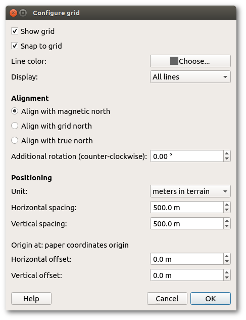

 The map grid can be activated by clicking the corresponding button in the <a href="toolbars.md#view">view toolbar</a>. Settings for the grid can be changed by clicking the arrow to the right of this button.

<h3>Grid settings</h3>

<h4 id="show">Show grid</h4>

Toggles the grid's visibility.

<h4 id="snap">Snap to grid</h4>

If activated, holding the Shift key while drawing or editing objects will snap not only to existing objects, but also to intersections of grid lines if the grid is visible.

<h4 id="color">Line color</h4>

The line color can be adjusted here.

<h4 id="display">Display</h4>

Here the display can be constrained to horizontal or vertical lines only.

<h4 id="alignment">Alignment</h4>

Here you can choose whether the vertical grid lines should align with magnetic north (which is assumed to be identical with the up direction of the paper), the grid north or true north directions. The latter work only if the map is <a href="georeferencing.md">georeferenced</a>. If grid north is selected, in addition the origin of the grid will be shifted to the grid coordinates origin. Furthermore, it is possible to define an offset angle which is added to the north angle to calculate the grid orientation.

<h4 id="positioning">Positioning</h4>

The spacing of the grid lines can be specified here. 
Normally, at the coordinate system origin there will always be a grid line intersection. Using the offset values, it can be shifted away from the coordinate system origin.

