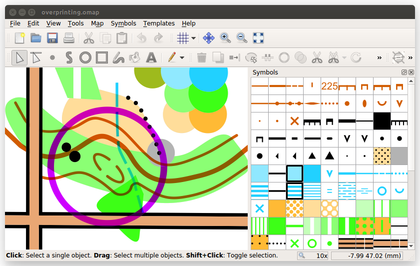

## The Desktop User Interface

On computers running Windows, macOS or Linux, the default appearance
of OpenOrienteering Mapper is the "Desktop User Interface".

### The Home Screen

When Mapper is running with no opened map file,
the program shows the "Home" screen.
It features buttons for key actions (left side)
and a list of recently used files (right side).

One special button is labeled "Touch mode". Using this button,
you can toggle the [Touch Mode User Interface](touch-mode.md).
This user interface is designed for mobile work with a touch screen,
and it is the only user interface offered on Android devices.
Note that the GNSS tracking feature is available only in touch mode
at the moment.

### The Map Editor

In the desktop user interface, the map editor window looks like this:

The **toolbars** at the top provide access to the drawing tools, among others. See the [list of all toolbar elements](toolbars.md).

In the middle, the currently opened **map** is displayed.

On the right, a list of all **symbols** in the currently opened map file is shown. See [symbols](symbol_dock_widget.md).

On the bottom, there is the **status bar** which shows useful information about the usage of the currently active tool. Just by reading these tips, you can learn a lot about the drawing tools without reading this manual.

You can rearrange the position of the toolbars and the symbol pane as you wish by dragging them to the desired location.
