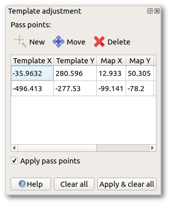

This window can be opened from the [template setup window](templates.md#setup) and is used to adjust the positioning of the currently selected template to the position of another existing template, or the map, which is already in the correct location.

The principle is to define two or more so-called pass points. Every pass point defines a source position, this is an arbitrary point on the new template, and a target position, this is the position where the source point should move to. So every pass point is a pair of identical positions on source (template) and target (existing template or map).

To create a new pass point, first select "New", then click at the source position on the template to position. The point should ideally be easily recognizable in both the template and the existing template or map. Zoom in close to place the point accurately. It is marked with a red plus. Then click the corresponding point in the existing template or map, which will be marked with a green plus. The pass point information will also be shown as a line of data in the pass point window. Repeat this for each of the remaining pass points.

In general, the more pass points you define, the more likely it is to get a good result. **One point** does not give enough information for positioning, so in this case the template is simply moved to this point. **Two points** are the minimum to define a similarity transformation, so the template will be moved, rotated and scaled isotropically so the pass points match exactly. For **more points**, the transformation is still constrained to a similarity transformation, so the transformation with the least error between desired and real pass point target positions is calculated. This way, not all pass points will end up at their target positions in general, but the result will usually be better because the information of more pass points is averaged.

When all pass points have been defined tick the box "Apply pass points" and your template will move to the position giving the minimum error. The actual error for each pass point will be shown on the dialog box. If this result is unsatisfactory either edit the pass points (use the "Move" tool above the table to adjust the position of either end of any tie), either while the transformation is still active or after clicking the "Apply pass points" check box again, or clear the pass points completely and try again.
