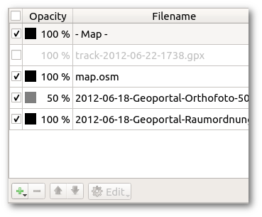

Images, tracks recorded with GPS receivers and other layers which are used to provide base information for the mapper are called templates. They can be loaded into the map file using the template setup window which is available via the menu item Templates -&gt; Template Setup Window. Templates can also be "abused" to display information on the final map, for example sponsor logos which are only available as raster images.

<b>Attention</b>: as templates are not covered by the undo/redo system, be sure to save your map before making changes to them!

<a name="types"><h4>Types of templates</h4></a>

OpenOrienteering Mapper supports the following file formats to be loaded as templates:

<ul>
<li><a href="#type_image">Image templates</a>: bmp, jpg, png, tif, gif files</li>
<li><a href="#type_track">Track templates</a>: dxf, gpx, osm files</li>
<li><a href="#type_map">Map templates</a>: omap, ocd files</li>
</ul>

Additionally, templates can be classified into <b>georeferenced</b> and <b>non-georeferenced</b> templates. For georeferenced templates, information about the exact positioning of the template in a known world coordinate system is available - see <a href="georeferencing.md">georeferencing</a>. This way, they can be positioned on the map automatically provided that the map is georeferenced too. For non-georeferenced templates, this information is not available, so they have to be <a href="#positioning">positioned manually</a>.

<a name="setup"><h4>Template setup window</h4></a>

    

This window is opened by clicking the menu item Templates -&gt; Template Setup Window. In its center is a list of all opened templates. In addition, the map layer is also included there. The order of items in this list defines the order in which the templates will be displayed: the first will be on the top, the last on the bottom.

Each item can be hidden or shown using the check box on the left. Furthermore, layers can be set to transparent by entering an opacity percentage.

<h4 id="open">Opening templates</h4>

Click the button "Open..." in the template setup window and select the file to be loaded as a template. See <a href="#types">types of templates</a> for the list of supported file formats.

<h4 id="draw_order">Changing the template draw order</h4>

When a template is selected, it can be moved up and down in the list using the Move Up and Mode Down buttons to change its position in the display order.

<h4 id="close">Deleting or closing templates</h4>

Using the Delete or Close button, templates can be removed. The label text depends on the <a href="settings.md#keep_closed_templates">corresponding setting</a> "Keep settings of closed templates": if it is activated, it will be "Close" and it will be possible to reopen the template later with the menu item Templates -&gt; Reopen template..., otherwise it will be "Delete" and it will not be possible to reopen the template later.

<h4 id="positioning">Positioning</h4>

At the bottom of the window, there are the template positioning capabilities:

The upper left button shows whether the template is <b>georeferenced</b>. Later it may become possible to switch the georeferencing setting using this button, but this is not yet implemented.

At the lower left is the <b>Move by hand</b> button. It allows to move non-georeferenced templates by clicking in the map display and dragging the mouse.

At the lower right is the toggle for the <b>template positioning window</b>. It enables to enter numerical values for the positioning of non-georeferenced templates, e.g. to rotate a template by 90 degrees, or to adapt the template rotation to the magnetic declination.

<a name="adjust">At the upper right is the <b>Adjust</b> button which enables to adjust the position of a non-georeferenced template to that of an existing template, or the map, which is in the correct position already.</a> <a href="template_adjust.md">Detailed instructions here</a>.

<h4>Template types</h4>

<a name="type_image"><h3>Image templates</h3></a>

Raster images are loaded as this template type. When opening such a template, the image positioning dialog is shown:

    

<h4>Georeferenced positioning</h4>

This option is only available if the image has georeferencing information associated. OpenOrienteering supports this via so-called world files. A world file for an image must have the same file name as the image file and be in the same directory. The world file extension is determined by the image extension: it consists of the first character of the image file extension, then the last character of this extension, and then the letter w. For example, a world file for a bmp file would have the extension bpw, or for tiff it would be tfw. Alternatively, the world file extension can also be wld.

World files are text files containing 6 entries of a transformation matrix mapping pixel coordinates to grid coordinates of some geodesic coordinate reference system (<a href="http://en.wikipedia.org/wiki/World_file">more information on Wikipedia</a>). Unfortunately, they do not specify which coordinate reference system it is. So if you choose this option for positioning, you have to specify the coordinate reference system in the next step. You should get this information from the place where you got the georeferenced image from. For example, in Germany it is usually UTM or Gauss-Kr&uuml;ger with a limited range of possible middle meridians.

In order for georeferenced positioning to work, the map must be georeferenced, too. If it is not at this point in time, the <a href="georeferencing.md">map georeferencing dialog</a> is shown as the next step, with the reference point coordinates already pre-filled as the center of the loaded image.

<h4>Manual positioning</h4>

This method of positioning should only be chosen if you have no georeferencing information available for the image. First, there are two possible options to specify the image scale:

<ul>
<li><b>Meters per pixel</b>: this is primarily useful for base maps from a digital source, where you may know this value directly. Alternatively you can also calculate it yourself: if your fieldwork image covers 500m width on the ground and the image is 1200 pixels wide then the scale will be 500 / 1200 = 0.625 metres per pixel. (Take care that the number of metres corresponds exactly the width of the image file.)</li>
<li><b>Scanned</b>: if your fieldwork is at a known scale (it should be &#8212; say 1:5000), and the scan is at a chosen resolution (say 200dpi) then these parameters may be entered to scale the fieldwork image. This assumes that printer and scanner work accurately.</li>
</ul>

Note that if you do not know the image scale and / or if you are going to adjust the template position to the existing map anyway using the <a href="#adjust">adjust feature</a>, you can just enter any value here as the scaling will be changed again later.

<a name="type_track"><h3>Track templates</h3></a>

These templates can be tracks from a GPS receiver (including waypoints) or vector graphics such as dxf files. For the latter, you have to select a coordinate reference system when loading the file. If it is just a drawing which is not georeferenced, select the option "Local" so will not be distorted.

<a name="type_map"><h3>Map templates</h3></a>

This template type enables to load other map files as a template. This has two main purposes:

<ul>
<li>Loading an old orienteering map as a base map for a new one.</li>
<li>Loading a map as a base layer to set a course on top of it.</li>
</ul>

For now, map templates can only be loaded as non-georeferenced.

