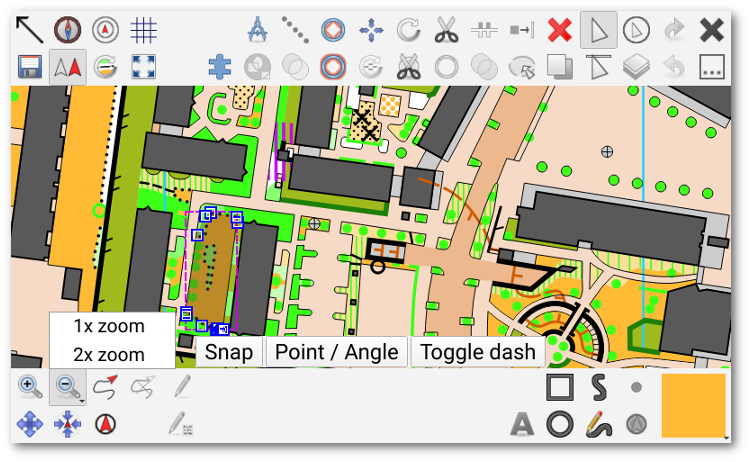

## Using the Mapper app in "Touch Mode"

The "Touch Mode" is an alternative user interface which is always active on
Android devices. It can be activated on PCs, too.

In Touch Mode, the map editor is different from the desktop version. It offers
a fixed set of buttons add the top and at the bottom of the screen. Not all
Mapper features are offered in Touch Mode, but on the other hands some features
such as live GNSS tracking are available only in this mode.

This page focuses on specific features of the touch mode user interface.
To find out about the other symbols, see the [Toolbars documentation](toolbars.md).

####  Hide the top bar

Using this button, you may hide the top bar, leaving more screen for the map. A similar button will remain visible for restoring the top bar again.

####  Compass display toggle

When this item is activated, a compass is shown in the top-left corner of the screen. The red line indicates the north direction, while the black-white lines show the up direction of your device. If both are aligned, the device is aligned with magnetic north. When the needle is close to the north direction, a green circle appears which quickly shows how well the device is aligned: the larger it is, the better the alignment is. The compass works three-dimensionally, so you do not need to hold the device in a flat pose for it to work.

Note: the usefulness of the compass depends on the presence of a gyroscope, as mentioned in the device recommendations section.

Attention: the compass is very sensitive to magnetic materials. Android tries the eliminate the influence of local magnetic fields, but this requires calibration. To do this, move the device around in the shape of an 8 while rotating it and while the compass is active. If the local influence changes, re-calibration is required.

####  Location display toggle

If the currently active map work has valid georeferencing, this control will be enabled and will show a dot at your current position as obtained from Global Navigation Satellite Systems (GNSS, e.g. GPS) or other positioning services. In addition, in case an accuracy estimate (HDOP) is available, this shows a circle around the dot which indicates the positioning accuracy. The chance of your real position being in the circle is approximately 70%.

While this is active, your track is automatically recorded into a GPX file in the directory of your map, named "<map> - GPS-<YYYY-MM-DD>.gpx". This file is included as a template in the map. You can simply show it using the template visibility control button to view your track.

Note that track recording might be interrupted while the screen is off or the app is in the background to save battery. Keep the app active if you want to ensure continuous track recording.

####  Distance rings toggle

This button is active if location display is active. When activated, this will display rings in 10 meter and 20 meter distance from the current location which can be used to do rough distance estimates.

####  Automatic north alignment toggle

When this toggle is active, the map is automatically rotated to north using the device's internal compass. The update frequency is 1 update per second. This is quite low on purpose to save battery, but you probably still need some replacement batteries when using this mode. While interacting with the map and for another 1.5 seconds after that, the map is not rotated to allow editing without unwanted rotations. If GNSS position display is activated at the same time, a line starting from the GNSS position and going in the direction of the up direction of your device is displayed which shows your viewing direction (assuming you are holding the device upright).

-----

####  Map parts selector

This button opens a popup for changing the active map part.

####  Touch cursor toggle

This symbol activates a helper cursor which allows slow, but precise editing with fingers only. The cursor consists of a circular area and a pointer above the circle.

Touching the map anywhere outside the circle moves the pointer to this position. Touching the circle simulates a real touch at the pointer position above the circle.

####  Template control

This shows a list of all opened templates. Touching a template toggles its visibility.

####  Close button

This closes the active map and returns to the map selection screen.

####  Overflow button

Depending on the screen size of your device, some of the symbols available not fit onto the screen. They are instead placed in a list which is shown on touching the overflow button. If all symbols fit on the screen, this button is unused.

-----

####  Zoom out / Zoom to fixed

A short press will zoom out by one step.

A long press will open a menu where you can jump to a fixed zoom (cf. screenshot).

####  Move to location

When positioning services are enabled, this will move the map so that your current location is in the middle of the screen.

A long press will open a menu where you can enable a mode which will automatically
move the map so that the current location stay in the central region of the screen.

####  Mark temporary position

This records a single point at your current location to act as a drawing help. Note that this marker is not saved in the map.

####  Record temporary trace

This symbol is enabled when the location display is active. It records a temporary trace of the location, which is intended to act as a guideline for drawings. Using the trace directly is rarely useful because of the inaccurateness of location services.
Note that the temporary trace is not saved in the map.

####  Clear temporary markers

This removes the temporary traces and position markers. (They will also be discarded when closing the map file.)

####  Paint on template

By this tool, mapper supports free-hand drawing onto raster image templates.
There is a small selection of colors for drawing as well as an eraser tool.
By additional buttons, you can choose to created filled areas instead of lines,
to use a dot pattern instead of a solid fill, or to draw only in the background
(transparent regions). There is also a dedicated undo/redo feature.

This tool is an convenient alternative when you want to do only (or mostly)
drafting in the field, but draw the final version of the map at home on a PC.
It does not create new map objects but only alters the template you draw on.
This may help to deal with low processing power or battery runtime on mobile
devices.

A short press may activate painting on the template which was used before if
it is still on the screen. Otherwise, or on long press, there is a menu which
indicates available templates, or offers to create a new template.

Please note that direct drawing onto regular base map images is *not* recommended:
Color and eraser tool would easily destroy important details.
Templates in JPEG format also should not be used: This is a lossy file format which
will introduce visible artifacts when saving the file and loading it repeatedly.

-----

####  Free-hand draw tool

Allows to draw paths free-handedly.

####  Draw at location tool

Sets a point object at your current location. Selecting this button first enters an averaging mode. While it is active, the input from the location service is averaged to get a more accurate estimate. Touch the map display anywhere to finish the averaging.

#### Symbol selector

Displays the active symbol, and opens the symbol selection screen on short press.

A long press of the symbol selector opens a popup menu which allows to read the symbol name and description, and to toggle the visibility and the protection state of the symbol.
